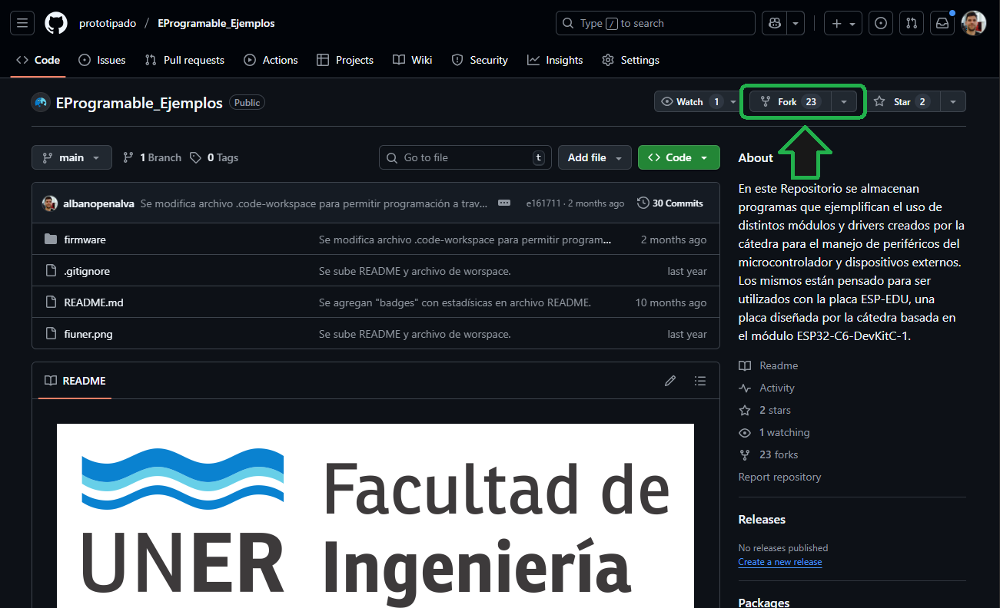
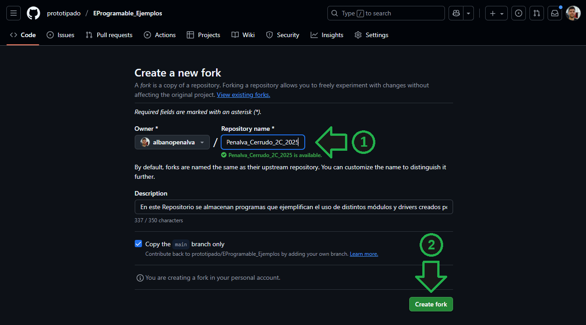
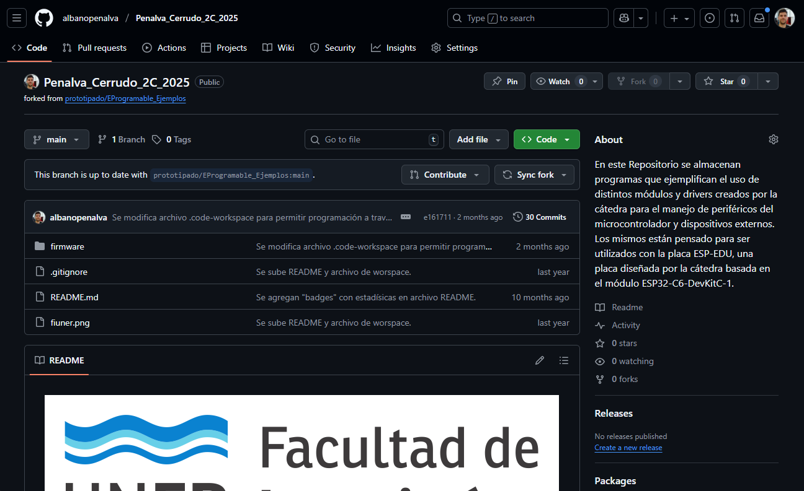
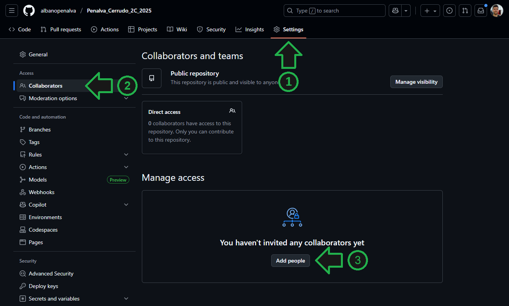
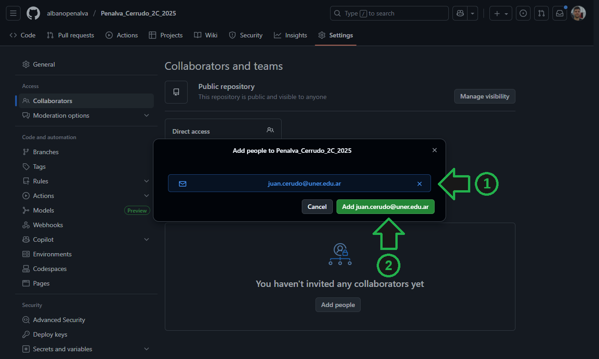

# Creación de Repositorio Compartido

A continuación se detallan los pasos para la creación de un repositorio compartido para el desarrollo del Proyecto Integrador. Este proceso lo debe uno de los miembros del grupo, quien se encargara de la creación del repositorio, para luego agregar al otro miembro del grupo como colaborador.

## Creación de Repositorio

1. Ingrese al repositorio de ejemplos de la cátedra: [github.com/prototipado/EProgramable_Ejemplos](https://github.com/prototipado/EProgramable_Ejemplos).

2. Haga click en la opción `Fork`. Esto creará una copia del repositorio de cátedra en su cuenta y le permitará que usted pueda modificarlo.

    

3. Ingrese el nombre de su repositorio como `[Apellido1]_[Apellido2]_[Cuatrimestre]_[Año]`, por ejemplo, `Penalva_Cerrudo_2C_2025`. Haga click en `Create fork`.

    

4. A continuación se lo redireccionará a la página principal de su repositorio.

    

## Agregar Colaboradores

1. En la sección `Settings` haga click en `Collaborators` y luego en `Add people`.

    

2. Ingrese el correo del colaborador (el que utilizó para la cuenta de GitHub) y haga click en `Add`.

    

---

Ahora ambos miembros del grupo podrán realizar modificaciones en el Repositorio.
